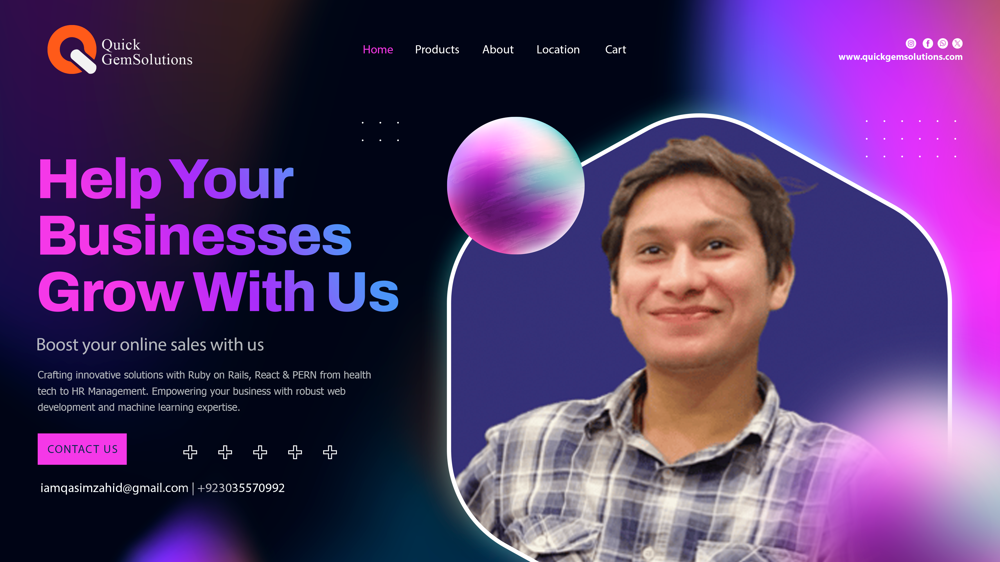

<!-- Header Section -->

 

<h1 style="font-size:2.8rem; margin-bottom:0.5rem;">Hi there </h1>
<h2 style="font-size:1.8rem; color:#666; margin-top:0;">Full Stack Developer | Ruby on Rails + React Specialist</h2>

<!-- Badges -->

  
  
  

<!-- Typing Animation -->

 

<!-- About Me Section -->

## 👨‍💻 About Me

  

    <h4 style="color:#2E86AB;margin-top:0;">🚀 Currently Working On</h4>
    
Web Applications with modern tech stacks

  

  
  

    <h4 style="color:#2E86AB;margin-top:0;">🌱 Learning</h4>
    
Backend Development (Python, Generative AI, LLM)

  

  
  

    <h4 style="color:#2E86AB;margin-top:0;">💡 Interests</h4>
    
Open Source Collaboration & Application Security

  

  
  

    <h4 style="color:#2E86AB;margin-top:0;">🤝 Looking To Collaborate</h4>
    
Generative AI, Fintech & Blockchain Projects

  

<!-- Tech Stack Section -->
## 🛠️ Tech Stack & Tools

### Frontend Technologies

  
  
  
  
  
  
  
  

### Backend Technologies

  
  
  
  
  

### Databases & Cloud

  
  
  
  
  
  
  

### Tools & Others

  
  
  
  
  

<!-- GitHub Stats -->
## 📊 GitHub Analytics

  

  

  

<!-- Projects Section -->
## 💼 Featured Projects

<!-- Project 1: Roavi -->

  

    <h3 style="color:#2E86AB;margin-top:0;display:flex;align-items:center;gap:10px;">
       Roavi
    </h3>
    
A comprehensive platform connecting travelers with local companions and guides. Built with React frontend and Ruby on Rails backend.

    

      React
      Ruby on Rails
      AWS S3
      PostgreSQL
    

    

      
      
    

  

<!-- Project 2: Badminton Tournament System -->

  

    <h3 style="color:#2E86AB;margin-top:0;display:flex;align-items:center;gap:10px;">
       Badminton Tournament System
    </h3>
    
Comprehensive tournament management system with three portals: Player, Tournament Management, and Admin.

    

      Next.js
      Express.js
      PostgreSQL
      Node.js
    

    

      
      
    

  

<!-- Project 3: Agency Pics -->

  

    <h3 style="color:#2E86AB;margin-top:0;display:flex;align-items:center;gap:10px;">
       Agency Pics
    </h3>
    
Platform connecting models, influencers, and creatives to showcase portfolios and network with industry professionals.

    

      React
      Ruby on Rails
      Stripe
      Heroku
    

    

      
      
    

  

<!-- Contact Section -->

## 📞 Let's Connect

I'm always open to discussing new opportunities, collaborations, or just having a tech chat!

  
  
  
  

<!-- Fun Section -->

## 😄 Fun Corner

  

  

  

  Made with
  
  and
  
  by Qasim Ali Zahid

