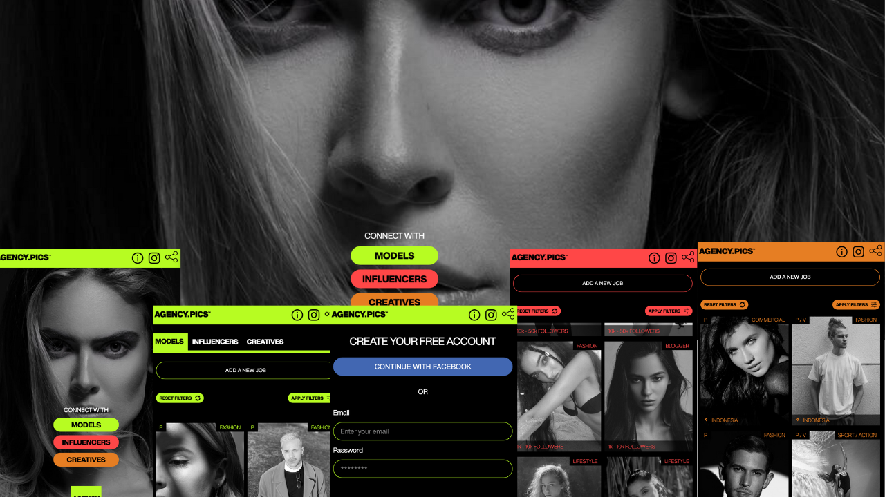
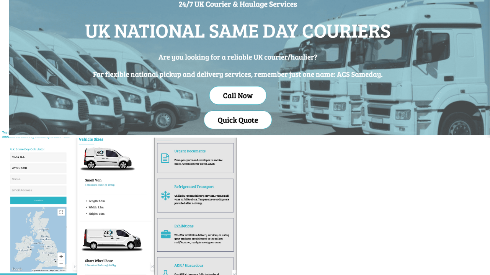
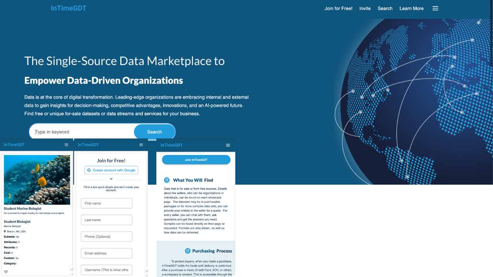

     

<h3>Hi there </h3>

<!-- TECHS -->

  
  
  
<!--    -->
  
 
   
     
  

<h2> 👨‍💻 Know Me </h2>

- 🔭 I’m currently working on Web Applications
- 🌱 Learning Backend Development (Python - Node - Data Structures and Algorithms)
- 💬 Interested in open source projects collaboration and app Security.
- 😄 Pronouns: He/Him
- ⚡  Motivated ✨
- 👯 I’m looking to collaborate on fintech & block-chain technology web application projects
- 💬 Ask me about Full-stack Web Applications
- 📫 How to reach me: iamqasimalizahid@gmail.com
- ⚡ Fun fact: The first computer “bug” was an actual real-life bug.

 

<h2> 🛠️ Languages and Tools </h2>

                 
                    
  
                       
		      
                      
                      
                       
                      
                      
                      
                       
                       
                       
                      
                      
                      
                      
                      
                      
                      
                      
                      
                      
                      
                

 

<!-- STATS -->

<h2> 🔥 Stats</h2>
  

  
&nbsp;

  

<!-- PROJECTS -->

<h2>Projects</h2>

	<table>
		<tr>
			<td width="50%">
				<h3 align="center">Agency Pics</h3>
				
  
					
					 
					 
					

					     
					   
					

					
<strong>Ruby on Rails, React, Sendgrid, Stripe Payments</strong>

          				

						<ul>
							<li>Heroku for Production Environment</li>
							<li>Stripe Checkouts, customers, Products</li>
							<li>Devise for Authentication</li>
							<li>Pendit for Authorization</li>
							<li>Postgreql || PG_Search </li>
							<li>Active Storage </li>
							<li>Kaminari </li>
							<li>REST API's</li>
							<li>Monthly subscriptions deduction || ActiveJobs || Sidekiq </li>
							<li>HTML, Bootstrap,SCSS, Javascript</li>
						</ul>
					

				

			</td>
			<td width="50%">
				<h3 align="center">Diamond Chauffeur Limousine</h3>
				
  
					
					 
					 
					

						  
							
					

					 
<strong>HTML, CSS, Javascript</strong>

					
Description goes here

				

        </tr>
	    <tr>
            <td width="50%">
                <h3 align="center">ACS Sameday</h3>
                
  
                    
                     
                     
                    

                          
						
                    

                    
<strong>HTML, CSS, Javascript</strong>

		    
Description goes here

                

            </td>
            <td width="50%">
                <h3 align="center">Intime GDT</h3>
                
  
                    
                     
                     
                    

                          
							
                    

                    
<strong>HTML, CSS, Javascript</strong>

		    
Description goes here

                
	
            </td>
        </tr>
	</table>

 
 

<!-- SOCIALS -->

<h2 align="center">Contact Me</h2>

	&nbsp&nbsp&nbsp
	&nbsp&nbsp&nbsp
&nbsp&nbsp&nbsp

 

<h2> 😆 Fun </h2>
 

  

     

   with  by [Qasim Ali Zahid]
  

