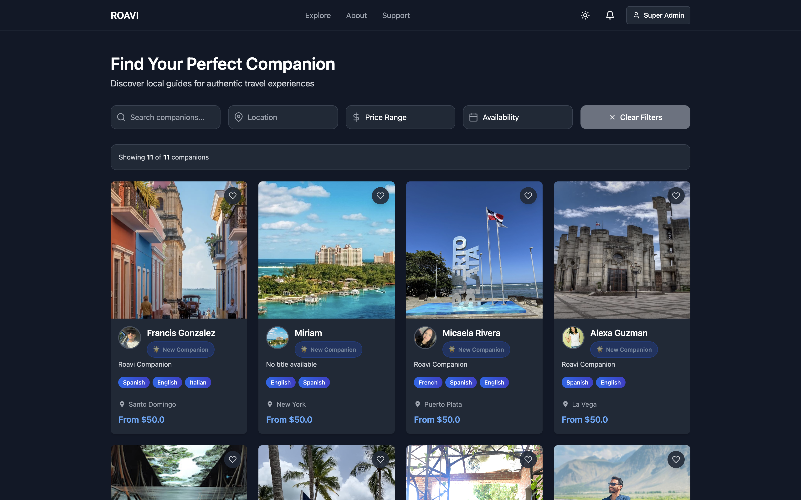
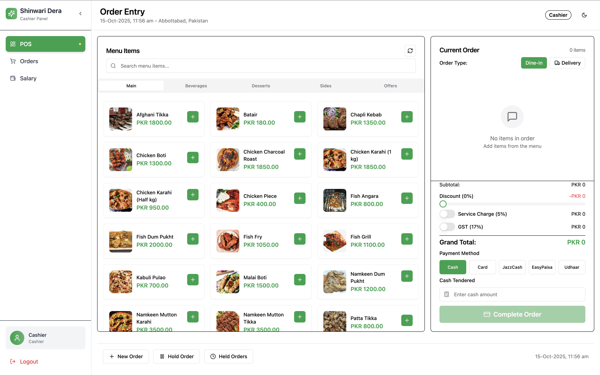
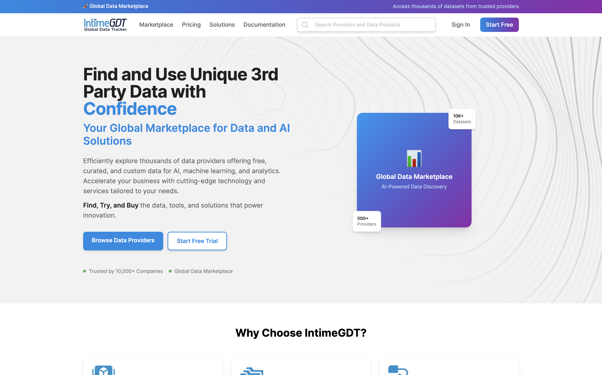
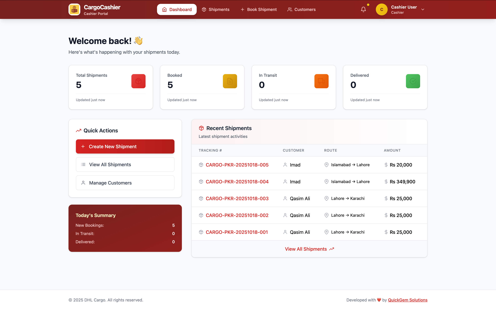
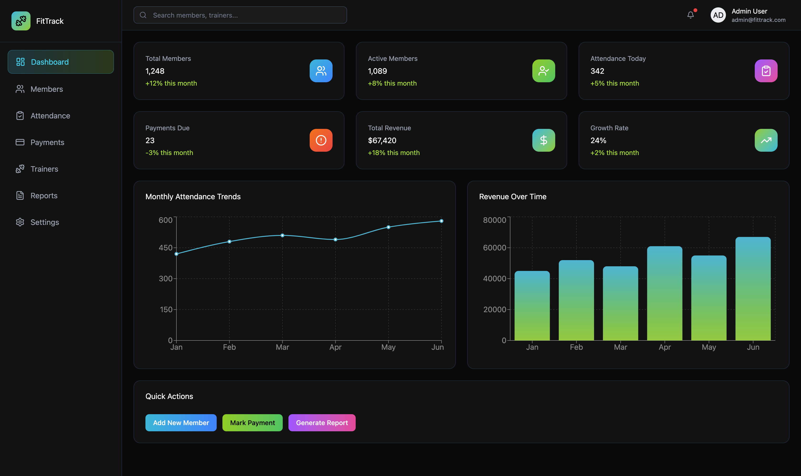

  
<!-- Header Section -->

 
<h1>Hi there </h1>
<h2 style="color:#666;">Full Stack Developer | Ruby on Rails + React Specialist</h2>
  <!-- Badges -->

  
  
  

 
<!-- Typing Animation -->

 

---

<!-- About Me Section -->
## 👨 About Me

  
  
  

 

I'm a **Full Stack Web Developer** passionate about building **production-grade applications** that scale. I transform ideas into robust digital solutions using modern technologies.

<table>
<tr>
<td width="50%">

### What I Do

- Build scalable web apps with **Ruby on Rails** & **React.js**
- Design and implement **RESTful APIs** & **GraphQL**
- Deploy to **AWS**, **Heroku**, and containerized environments
- Integrate **AI/LLM solutions** for automation
- Develop **PERN stack** applications end-to-end

</td>
<td width="50%">

### Quick Facts

- Based in Pakistan
- Available for freelance & full-time roles
- Love solving complex problems
- Open source enthusiast
- Always learning new technologies

</td>
</tr>
</table>

---

## 🧠 Technical Skills

| Category | Technologies |
|:--------:|:-------------|
| **Languages** |     |
| **Frontend** |     |
| **Backend** |     |
| **Database** |     |
| **Cloud** |     |
| **AI/ML** |    |

---

## 🤝 Let's Connect

 

  <i>I'm passionate about building impactful digital products and helping businesses scale. Whether you need an MVP, a full SaaS platform, or AI integration — let's build something amazing together!</i>

 

<!-- Tech Stack Section -->
## 🛠️ Tech Stack & Tools

### Frontend Technologies

  
  
  
  
  
  
  
  

### Backend Technologies

  
  
  
  
  
  
  
  

### Databases & Cloud

  
  
  
  
  
  
  

### Static Site Generators & AI/ML

  
  
  
   

### Tools & Others

  
  
  
  
  

 

<!-- GitHub Stats -->
## 📊 GitHub Analytics

 

<!-- Projects Section -->
## 💼 Featured Projects

### 🚀 Roavi - Travel Companion Platform
**🔗 Live Demo:** [roavi.com](https://roavi.com/) | **📁 Repository:** [GitHub](https://github.com/iamqasimali/agency_pics)

  

A comprehensive platform connecting travelers with local companions and guides. Built using React for a dynamic front-end experience and Ruby on Rails for robust server-side logic.

**🛠️ Tech Stack:** Ruby on Rails, React, Heroku, AWS S3, PostgreSQL, Devise, JWT, Stripe

**Frontend:** React.js, JavaScript, JSX, TailwindCSS, Chart.js, Axios, React Query, Formik  
**Backend:** Devise, Stripe, Pundit, Sidekiq, Active Storage, SendGrid

---

### 🏪 Restaurant POS System - Complete Management Solution
**🔗 Live Demo:** [POS Demo](https://shinwariderapos.netlify.app/) | **📁 Repository:** [GitHub](https://github.com/iamqasimali/restaurant-pos)

  

A comprehensive Point of Sale system designed for modern restaurants, featuring multi-portal access, real-time inventory management, and detailed analytics. Streamlines restaurant operations from order taking to financial reporting.

**🛠️ Tech Stack:** React, TailwindCSS, Node.js, Express.js, PostgreSQL, JWT, Socket.io

**Key Features:**
- **Cashier Portal:** Order management, table booking, billing, invoice generation
- **Admin Portal:** Complete business oversight, reports, employee management
- **Inventory Management:** Real-time stock tracking, low stock alerts, supplier management
- **Reporting & Analytics:** Sales reports, revenue analytics, performance metrics
- **Employee Management:** Staff scheduling, role-based access, performance tracking
- **Utensils & Equipment:** Maintenance tracking, usage logs, replacement scheduling

**Frontend:** React, TailwindCSS, Redux Toolkit, React Query, Chart.js, React Hook Form
**Backend:** Node.js, Express.js, JWT Authentication, Socket.io, Bcrypt, CORS
**Database:** PostgreSQL with complex relations for inventory, orders, and users

---

### 🏸 Badminton Tournament Management System
**🔗 Live Demo:** [agency.pics](https://www.agency.pics/) | **📁 Repository:** [GitHub](https://github.com/iamqasimali/agency_pics)

  

Comprehensive tournament organization system with three distinct portals: Player, Tournament Management, and Admin. Built using the MERN stack.

**🛠️ Tech Stack:** Next.js, React, Express.js, Node.js, AWS S3, PostgreSQL

**Frontend:** Next.js, JavaScript, React, TailwindCSS, Chart.js, Axios, React Query  
**Backend:** Express.js, JWT, Sequelize, Bcrypt, CORS

---

### 📸 Agency Pics - Creative Networking Platform
**🔗 Live Demo:** [agency.pics](https://www.agency.pics/) | **📁 Repository:** [GitHub](https://github.com/iamqasimali/agency_pics)

  

Platform designed to connect models, influencers, and creatives. Allows users to showcase portfolios and network with industry professionals.

**🛠️ Tech Stack:** Ruby on Rails, React, SendGrid, Stripe Payments, Heroku, AWS S3

**Frontend:** React, SCSS, Bootstrap, JavaScript, Chart.js, React Image Gallery  
**Backend:** Stripe, Devise, Pundit, Sidekiq, Active Storage, Kaminari

---

### 📊 IntimeGDT - Data Marketplace
**🔗 Live Demo:** [intimegdt.com](https://intimegdt.netlify.app/) | **📁 Repository:** [GitHub](https://github.com/iamqasimali/intimeGDT)

  

Platform providing access to diverse datasets for real-time data discovery, evaluation, and integration across various industries and domains.

**🛠️ Tech Stack:** Next.js, React, TailwindCSS, Ruby on Rails, SendGrid, Stripe

**Frontend:** Next.js, React, TailwindCSS, Chart.js, React Query, Formik  
**Backend:** Ruby on Rails, Stripe, Devise, Sidekiq, AWS S3

---

### 📦 DHL Cargo Management System – Full Logistics Platform
**🔗 Live Demo:** (Coming Soon) | **📁 Repository:**  [GitHub](https://github.com/iamqasimali/DHL-Cargo)

A comprehensive cargo booking and logistics tracking platform built for freight forwarders and shipping agents. The system enables cashiers to manage shipments, track customer payments, and coordinate with carriers like DHL, UPS, and FedEx — while admins oversee operations, users, and financials.

**🛠️ Tech Stack:**  PERN Stack (PostgreSQL, Express, React, Node.js), Vite, TailwindCSS, JWT, Sequelize

**Key Features:**

-  Dual Portal System: Role-based interfaces for Cashiers (booking, customer mgmt) and Admins (user/shipment oversight, reporting)
-  Shipment Lifecycle: Full CRUD with auto-generated PKR-based tracking numbers (CARGO-PKR-YYYYMMDD-001)
- Financial Tracking: Record customer payments and carrier costs, calculate profit per shipment
- Customer & Carrier Management: Admin-only CRUD for customers and service providers (DHL, UPS, etc.)
- Responsive UI: Mobile-first design with role-aware dashboards, tables, and forms
- Secure Auth: JWT + HttpOnly cookies, role-based middleware (admin/cashier)
**Frontend:**  React, Vite, TailwindCSS, React Router, Formik, React Icons
**Backend:**  Node.js, Express, JWT, Bcrypt, Sequelize ORM, PostgreSQL
**DevOps:**  RESTful APIs, Proxy setup (Vite → Express), Role-based routing
### 🏋️ FitTrack – Gym & Training Attendance & Finance System
🔗 Live Demo: (Coming Soon) | 📁 Repository: [GitHub](https://github.com/iamqasimali/fit_track)

A modern attendance and financial management platform built for gyms, training centers, and fitness studios. FitTrack enables staff to scan QR codes for instant attendance tracking, manage member/trainer fees, and generate detailed reports — all in one place.

**🛠️ Tech Stack:** PERN Stack (PostgreSQL, Express, React, Node.js), Vite, TailwindCSS, JWT, Sequelize ORM

**Key Features:**

- **QR Code Attendance:** Members & trainers scan unique IDs to check in — system auto-logs time and displays user details.
-  **Role-Based Access:** Admins manage users; Staff mark payments; Trainers view their schedules.
-  **Financial Tracking:** Track monthly fees from members and salaries for trainers.
- **Automated Reporting:** Generate PDF/Excel reports for attendance, revenue, and growth trends.
Dashboard Analytics: Real-time charts for total members, active users, daily attendance, and revenue over time.
**Frontend:** React, Vite, TailwindCSS, React Router, Formik, React Icons, Recharts
**Backend:** Node.js, Express, JWT, Bcrypt, Sequelize ORM, PostgreSQL
**DevOps:** RESTful APIs, Proxy setup (Vite → Express), Role-based middleware (admin, staff, trainer)

### 🛡️ Elite Sentry - Monitoring Platform
**🔗 Live Demo:** [agency.pics](https://elitesentry.com/) | **📁 Repository:** [GitHub](https://github.com/iamqasimali/elitesentry)

  

Web-based monitoring and observability platform providing real-time insights into IT infrastructure, applications, and systems.

**🛠️ Tech Stack:** AlpineJS, TailwindCSS, Hugo, Netlify

**Features:** Real-time monitoring, Customizable dashboards, Performance metrics, Error tracking

---

### 💰 BlueBolivia - Currency Tracking Platform
**🔗 Live Demo:** [bluebolivia.com](https://bluebolivia.com/) | **📁 Repository:** [GitHub](https://github.com/iamqasimali/blue_bolivia)

  

Intuitive platform for tracking and converting between multiple currencies with focus on Bolivian economy. Features detailed charting and admin capabilities.

**🛠️ Tech Stack:** MERN Stack, Tailwind CSS, Binance APIs, Currency Rate APIs

**Frontend:** React, TailwindCSS, Chart.js, Axios, React Query  
**Backend:** Node.js, Express.js, JWT, Cron jobs, Multiple API integrations

---

### 🚗 CarShare - Car Rental Platform
**🔗 Live Demo:** [agency.pics](https://www.carshare.com/) | **📁 Repository:** [GitHub](https://github.com/iamqasimali/carshare)

  

Modern car sharing platform enabling short-term car rentals by the hour. Connects car owners with renters through a seamless digital experience.

**🛠️ Tech Stack:** Next.js, React, TypeScript, TailwindCSS, Ruby on Rails, Stripe

**Frontend:** Next.js, TypeScript, TailwindCSS, React Query, Formik  
**Backend:** Ruby on Rails, Stripe, Devise, AWS S3, SendGrid

---

### 🚘 Diamond Chauffeur Limousine
**🔗 Live Demo:** [Visit Site](https://diamondchauffeurtourism.com) | **📁 Repository:** [GitHub](https://github.com/iamqasimali/dcl)

  

Luxury transportation service website providing premium chauffeur services with elegant design and seamless user experience.

**🛠️ Tech Stack:** HTML, CSS, JavaScript

**Features:** Responsive design, Booking system, Service showcase, Contact management

 

<!-- Contact Section -->
## 📞 Let's Connect

I'm always open to discussing new opportunities, collaborations, or just having a tech chat!

 

<!-- Fun Section -->
## 😄 Fun Corner

 

 

Made with ❤️ and 💻 by **Qasim Ali Zahid**

