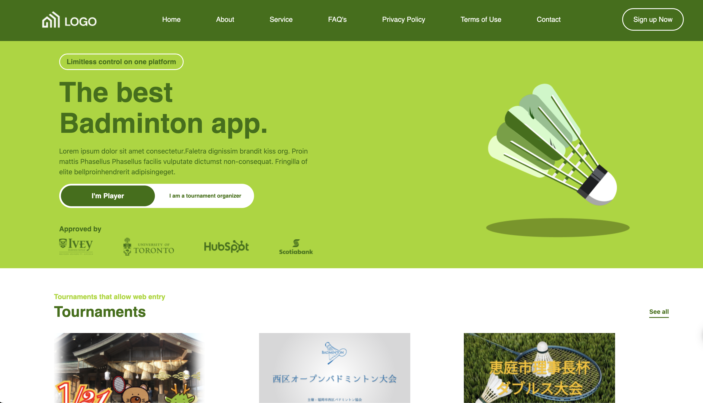
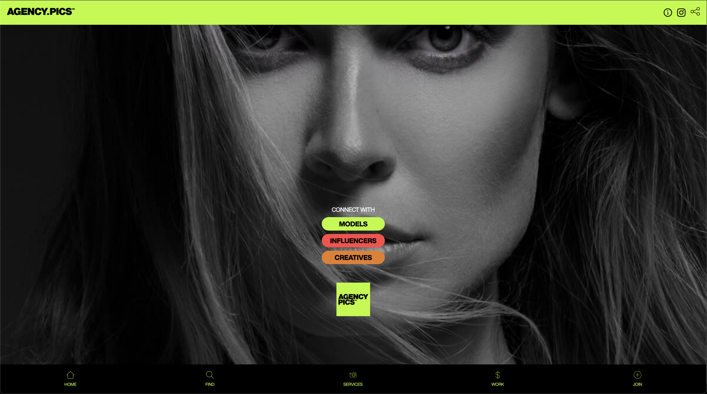
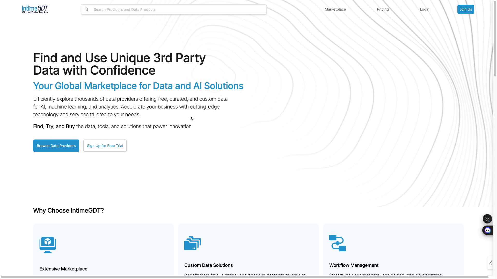
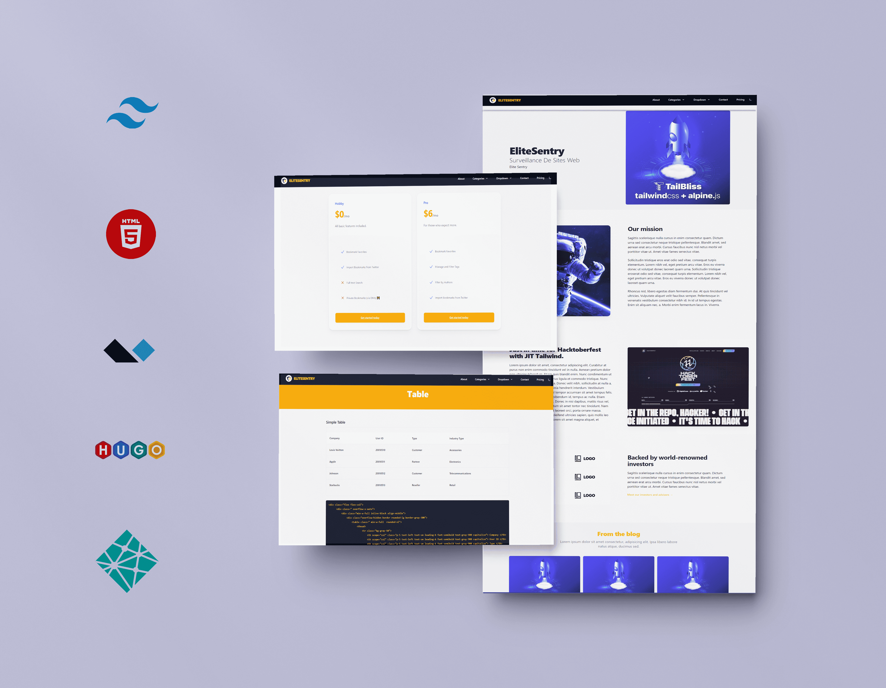
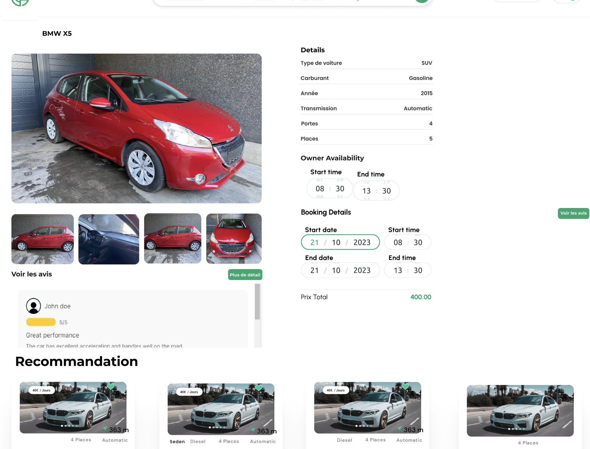

    <!--   -->
    

<h3>Hi there </h3>

<!-- TECHS -->

  
  
  
<!--    -->
  
 
   
  

<h2> 👨‍💻 Know Me </h2>

- 🔭 I’m currently working on Web Applications
- 🌱 Learning Backend Development (Python, Generative AI, LLM)
- 💬 Interested in open source projects collaboration and app Security.
- 😄 Pronouns: He/Him
- ⚡  Motivated ✨
- 👯 I’m looking to collaborate on Generative AI, fintech & block-chain technology web application projects
- 💬 Ask me about Full-stack Web Applications
- 📫 How to reach me: iamqasimalizahid@gmail.com
- ⚡ Fun fact: The first computer “bug” was an actual real-life bug.
 

<h2> 🛠️ Languages and Tools </h2>

                 
                    
  
                       
		      
                      
                      
                      
                      
                      
		      
		      
		      
		      
		     	    
                       
                         
                       
                      
                      
                      
                      
                      
                      
                      
                      
                      
	                  
                      
                      
                

 
<!-- STATS -->

<h2> 🔥 Stats</h2>
  

  
&nbsp;

  
&nbsp;

<!-- PROJECTS -->
<h2>Projects</h2>

	<table>
    <tr>
	<td width="100%">
		<h3 align="">Badminton</h3>
        

        The project is a comprehensive badminton tournament organization and management system featuring three distinct portals: Player, Tournament Management, and Admin. Built using the MERN stack, this system leverages React for a dynamic front-end experience, Express.js for the backend API, and PostgreSQL for robust data management.
        

				
  
					
					 
					 
					

					     
					   
					

					
<strong>Next.js, React, Express.js, Nodejs, AWS S3, Postgresql</strong>

          

          <strong>
          Frontend
          </strong>
          

          

             Next.js, Javascript, React, JSX, TailwindCSS, useState, useEffect, useRef, Axios, Chart.js, Cropperjs,  Flatpickr, react-google-recaptcha, react-image-gallery, react-infinite-scroll-component, react-loader-spinner, react-loading-skeleton, react-phone-number-input, Axios, react-query, formik
          

          

            <strong>
              Backend
            </strong>
          

          

            Bcryptjs, cookie-parser, joi, cors, dotenv, express, jsonwebtoken, sequelize, uuid, Heroku, AWS S3, Postgresql
          

				

			</td>
		<tr>
			<td width="100%">
				<h3>Agency Pics</h3>
        

        Agency.pics is a platform designed to connect models, influencers, and creatives. It allows users to showcase their portfolios and network with industry professionals. The site aims to streamline the process of finding and collaborating with talent for various creative projects.
        

				
  
					
					 
					 
					

					     
					   
					

					
<strong>Ruby on Rails, React, Sendgrid, Stripe Payments, Heroku, AWS S3</strong>

          

          <strong>
          Frontend
          </strong>
          

          

            React, SCSS, Bootstrap, Javascript, useState, useEffect, useRef, Axios, Chart.js, Cropperjs, Flatpickr, react-share, react-google-recaptcha, react-image-gallery, react-infinite-scroll-component, react-loader-spinner, react-loading-skeleton, react-phone-number-input, react_ujs
          

          

            <strong>
              Backend
            </strong>
          

          

            Stripe Checkout, Stripe Customers, Stripe Products, Devise, Pendit, Pg-search, Simple_form, Omniauth-facebook, Gibbon,  Faker, Sendgrid-ruby, Sentry-rails, Sidekiq, Activejobs, ActiveStorage, Kaminari, Heroku, AWS S3
          

				

			</td>
   </tr>
   <tr>
			<td width="100%">
				<h3>IntimeGDT</h3>
        

          The IntimeGDT provides access to a wide variety of datasets, allowing users to discover, evaluate, and access data in real-time. It offers data products from multiple providers that can be seamlessly integrated into users' data ecosystems for various use cases, including analytics, machine learning, and business intelligence. The marketplace includes datasets across different industries and domains, helping organizations make data-driven decisions.
        

				
  
					
					 
					 
					

					     
					   
					

					
<strong>Next.js, React, TailwindCSS, Ruby on Rails, Sendgrid, Stripe Payments</strong>

          

          <strong>
          Frontend
          </strong>
          

          

            React, SCSS, Bootstrap, Javascript, useState, useEffect, useRef, Axios, Chart.js, Cropperjs, Flatpickr, react-share, react-google-recaptcha, react-image-gallery, react-infinite-scroll-component, react-loader-spinner, react-loading-skeleton, react-phone-number-input, react_ujs, formik, react-query
          

          

            <strong>
              Backend
            </strong>
          

          

            Stripe Checkout, Stripe Customers, Stripe Products, Devise, Pendit, Pg-search, Simple_form, Omniauth-facebook, Gibbon,  Faker, Sendgrid-ruby, Sentry-rails, Sidekiq, Activejobs, ActiveStorage, Kaminari, Heroku, AWS S3
          

				

			</td>
   </tr>
      <tr>
			<td width="100%">
				<h3>Elite Sentry</h3>
        

        Web-based monitoring and observability platform, built using Hugo, Tailwind CSS, and Alpine.js. It provides real-time insights into IT infrastructure, applications, and systems, allowing users to monitor performance, errors, and logs. The platform features a modern, responsive interface designed with Tailwind CSS, offering an intuitive user experience across all devices. With the help of Alpine.js, Elite Sentry includes dynamic, interactive components for smooth front-end interactivity. It supports customizable dashboards for visualizing critical data metrics.
        

				
  
					
					 
					 
					

					     
					   
					

					
<strong>AlpineJS, TailwindCSS, Hugo, Netlify</strong>
          

				

			</td>
   </tr>
   </tr>
      <tr>
			<td width="100%">
				<h3>BlueBolivia</h3>
        

         BlueBolivia is an intuitive platform built to meet the needs of users looking to track and convert between multiple currencies, with a special focus on the Bolivian economy. With its detailed charting capabilities and administrative features, BlueBolivia serves as a robust tool for both casual users and professionals interested in monitoring currency fluctuations.
        

				
  
					
					 
					 
					

					     
					   
					

					
<strong>MERN Stack (MongoDB, Express.js, React, Node.js), Tailwind CSS, Binance APIs, Currency Rate APIs</strong>
          

          <strong>
          Frontend
          </strong>
          

          

            React, TailwindCSS, Javascript, useState, useEffect, useRef, Axios, Chart.js, react-loader-spinner, react-loading-skeleton, react-phone-number-input, formik, react-query
          

          

            <strong>
              Backend
            </strong>
          

          

            Binance API's, Currency Converter APIs, Express.js, Node.js, Joi, axios, cors, cron, node-cron,  csv-parser, jsonwebtoken, moment, dotenv
          

				

			</td>
   </tr>
    <tr>
			<td width="100%">
				<h3>CarShare</h3>
        

        Carshare is a model of car rental where people rent cars for short periods of time, often by the hour. It differs from traditional car rental in that the owners of the cars are often private individuals themselves, and the car sharing facilitator is generally distinct from the car owner. Car sharing is part of a larger trend of shared mobility.
        

				
  
					
					 
					 
					

					     
					   
					

					
<strong>Next.js, React, Typescript, TailwindCSS, Ruby on Rails, Sendgrid, Stripe Payments</strong>

          

          <strong>
          Frontend
          </strong>
          

          

            Next.js, React, TailwindCSS, Javascript, Axios, Chart.js, Cropperjs, Flatpickr, react-share, react-google-recaptcha, react-image-gallery, react-infinite-scroll-component, react-loader-spinner, react-loading-skeleton, react-phone-number-input, formik, react-query
          

          

            <strong>
              Backend
            </strong>
          

          

            Stripe Checkout, Stripe Customers, Stripe Products, Devise, Pendit, Pg-search, Simple_form, Omniauth-facebook, Gibbon,  Faker, Sendgrid-ruby, Sentry-rails, Sidekiq, Activejobs, ActiveStorage, Kaminari, Heroku, AWS S3
          

				

			</td>
   </tr>
   <tr>
			<td >
				<h3>Diamond Chauffeur Limousine</h3>
				
  
					
					 
					 
					

						  
							
					

					 
<strong>HTML, CSS, Javascript</strong>

					
Description goes here

				

        </tr>
	</table>

 
 

<!-- SOCIALS -->

<h2 align="center">Contact Me</h2>
<!-- 

 -->

	

 
<h2> 😆 Fun </h2>
 

  

     

   with  by [Qasim Ali Zahid]
  
</div
